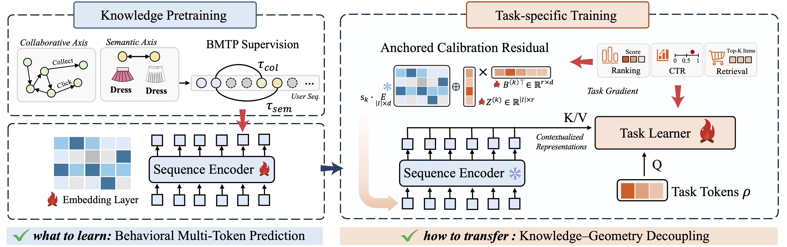

# KGD

This repository provides a reference implementation of KGD, using ManCAR as the backbone on eight public benchmarks, from our paper:
> Zixuan Wang, Yuhong Chen, Yuxuan Zhu, Guidong Lei, Zhiluohan Guo, Yu Zhao, Kun Wang, Bangyang Hong, Kangle Wu, Yabo Ni, Anxiang Zeng, Cong Fu, and Hui Li. **Knowledge–Geometry Decoupling: Refreshable Pretrained Transfer for Streaming Recommendation.**

## Resources

- 🔗 arXiv Paper: Coming Soon
- 🤗 Hugging Face Paper: Coming Soon
- 🤗 Hugging Face Dataset: https://huggingface.co/datasets/PIIR/KGD-dataset

## Overview

KGD assigns pretrained behavioral knowledge and task-specific geometry to separate parameter sets: a refreshable encoder, pretrained with Behavioral Multi-Token Prediction (BMTP), owns behavioral knowledge, while a task learner reads its contextualized states through read-only cross-attention and writes task-specific geometry via the Anchored Calibration Residual (ACR).



## Requirements

We recommend `python=3.10+` with the following dependencies:

```
torch==2.4.1
numpy
tqdm
pandas
pyarrow
```

## Dataset Processing

We use eight Amazon categories: `Arts_Crafts_and_Sewing`, `Beauty_and_Personal_Care`, `CDs_and_Vinyl`, `Cell_Phones_and_Accessories`, `Office_Products`, `Software`, `Toys_and_Games`, and `Video_Games`.

We recommend running the code with the preprocessed datasets we provide on Hugging Face, which include:

- ready-to-train datasets;
- the collaborative / semantic embeddings required by BMTP pretraining;
- the Manifold-Constrained swing graph required by ManCAR.

After downloading, place the files under `ManCAR_KGD/` as follows (using `Software` as an example):

```bash
ManCAR_KGD/
├── processed_llo_graph/
│   └── Software/                 # ready-to-train dataset
│       ├── Software.train.csv
│       ├── Software.valid.csv
│       ├── Software.test.csv
│       ├── Software.item.csv
│       └── graph/
│           └── swing.parquet     # Manifold-Constrained swing graph (ManCAR)
├── graph_emb/
│   └── Software/
│       └── graph_emb.csv         # collaborative embedding (BMTP)
└── text_emb/
    └── Software/
        └── text_emb.csv          # semantic embedding (BMTP)
```

We also provide the scripts to build the datasets from raw data. Place the raw leave-last-out splits under `ManCAR_KGD/raw_llo/`, then run the following from `ManCAR_KGD/datasets`:

```bash
python amazon_llo.py --dataset_name Software
python item_csv_llo.py --dataset_name Software
```

## Training

Training has two stages. Run the following from `ManCAR_KGD`:

```bash
cd ManCAR_KGD

# Stage 1: pretrain the refreshable KGD encoder
DATASET=Software bash run_pretrain.sh

# Stage 2: task training (set PRETRAIN_INIT_PATH to the Stage 1 encoder weights)
DATASET=Software PRETRAIN_INIT_PATH=save_model/Software/pretrain/xxx.pt bash run_mancar_kgd.sh
```

## Acknowledgements

Our code is built upon the official [ManCAR](https://github.com/FuCongResearchSquad/ManCAR) and [ReaRec](https://github.com/TangJiakai/ReaRec) repositories, and we sincerely thank their authors.
